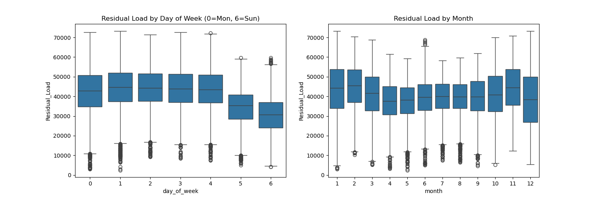

# Energy Thesis 2026
This repository contains the data pipeline and analysis for my thesis, [Grid Stability in the Age of Renewables: A Comparative Deep Learning Approach to Residual Load Forecasting].

## Structure
- `CORE SCRIPTS/`: Python scripts for data processing and modeling.
- `DATA/`: (Instructions on how to access data).

## How to Run
1. Install requirements: `pip install -r requirements.txt`
2. Run acquisition: `python SRC/01_get_data.py`

