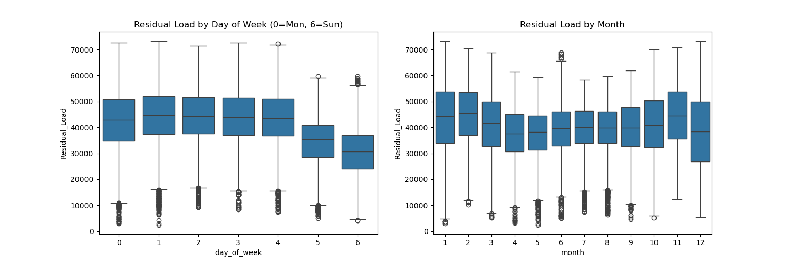

# Energy Thesis 2026
This repository contains the data pipeline and analysis for my thesis, [Grid Stability in the Age of Renewables: A Comparative Deep Learning Approach to Residual Load Forecasting].

## Structure
- `SRC/`: Python scripts for data processing and modeling.
- `DATA/`: (Instructions on how to access data).

## How to Run
1. Install requirements: `pip install -r requirements.txt`
2. Run acquisition: `python SRC/01_get_data.py`




# Grid Stability in the Age of Renewables: A Comparative Deep Learning Approach to Residual Load Forecasting

Master's thesis, Data Science and Society, Tilburg University (July 2026, with Distinction)

## Overview

This project benchmarks three deep learning architectures for forecasting **residual load** (electricity demand minus renewable generation) on the German energy grid, across three forecast horizons: 24 hours, 168 hours (one week), and 720 hours (one month). Residual load forecasting is increasingly critical for grid stability, as rising renewable penetration increases the variance and non-stationarity of residual load, making accurate forecasting increasingly important for unit commitment, reserve planning, and grid balancing. In other words, the increase of renewables makes it harder to predict the conventional generation capacity needed to balance supply and demand.

**Architectures compared:**
- **TFT** (Temporal Fusion Transformer) — hybrid LSTM-attention architecture
- **PatchTST** — patch-based pure Transformer architecture
- **QR-PatchTST** — a quantile regression variant of PatchTST, extended with a 4x encoder multiplier, separate known-future/unknown feature branches, tunable patch size/stride and encoder depth, and an MLP prediction head

## Key Results

| Horizon | Best point forecast | Best calibration (pinball loss) |
|---|---|---|
| 24h | TFT (~29% lower MAE) | QR-PatchTST |
| 168h | PatchTST | QR-PatchTST |
| 720h | PatchTST | QR-PatchTST (gap widens vs. others) |

QR-PatchTST delivers the best uncertainty calibration at every time horizon, with its advantage growing at longer horizons -- an indication that it is the strongest choice when forecast *confidence* matters, not just accuracy, for motivating downstream grid-balancing decisions.

## Repository Structure

```
SRC/
├── weather_download.py       # Weather data acquisition
├── preprocess_data.py        # Data cleaning and preprocessing
├── cleaning_time_series.py   # Time series-specific cleaning
├── total_wind_generation_check.py  # Data integrity check
├── train_tft.py              # Final TFT model training
├── train_patchtst.py         # Final PatchTST model training
├── train_qr_patchtst.py      # Final QR-PatchTST model training
└── archive/                  # Earlier/superseded script versions

DATA/            # Raw and processed data (see Data Access below)
NOTEBOOKS/       # Exploratory analysis and results notebooks
EDA_Results/     # Exploratory data analysis outputs
PLOTS/           # Generated figures
checkpoints/     # Trained model checkpoints
appendix_summary_stats.csv   # Summary statistics tables
```

## Method

Models were trained on Tilburg University's GPU cluster (NVIDIA A40s, SLURM job scheduling), accessed remotely via SSH. Evaluation used MAE, RMSE, SMAPE, and pinball loss (for quantile calibration) across all three architectures and all three forecast horizons.

## How to Run

```bash
pip install -r requirements.txt

# Data pipeline
python SRC/weather_download.py
python SRC/preprocess_data.py
python SRC/cleaning_time_series.py

# Model training
python SRC/train_tft.py
python SRC/train_patchtst.py
python SRC/train_qr_patchtst.py
```

## Data Access

This project uses five years (2015–2019) of hourly German energy and weather data, combining electricity demand and solar/wind generation from the ENTSO-E Transparency Platform with meteorological features (wind speed, irradiance) from Open Power System Data's weather database, itself derived from ERA5 (Copernicus). To ensure full national coverage, weather data covers a bounding box slightly exceeding Germany's borders (55.1°N–47.2°N, 5.8°E–15.2°E). The final merged dataset (DATA/final_data_with_features.csv) contains 43,824 hourly observations.

## Environment

- Python, PyTorch
- Pandas, NumPy, SciPy, Matplotlib
- Trained on SLURM-managed GPU cluster (NVIDIA A40)

## Thesis

The full written thesis is available on request.